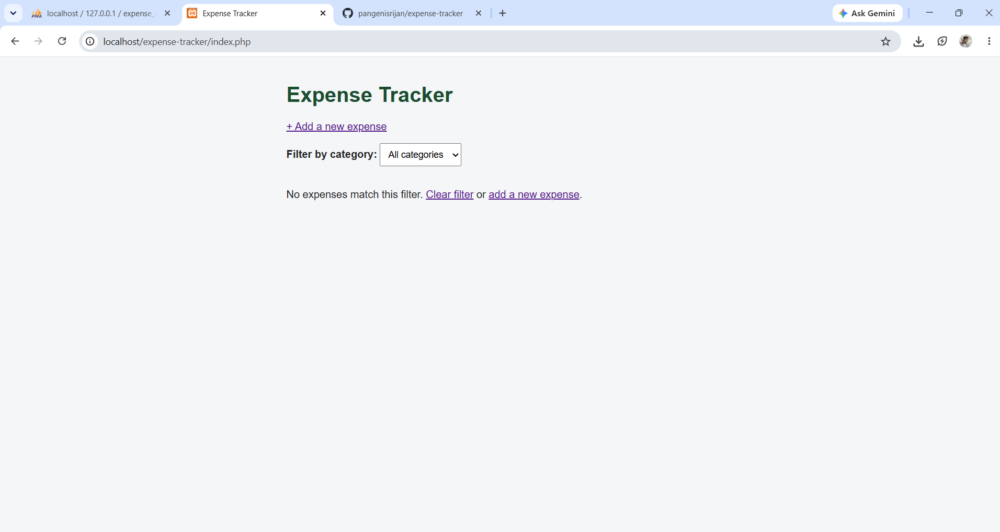
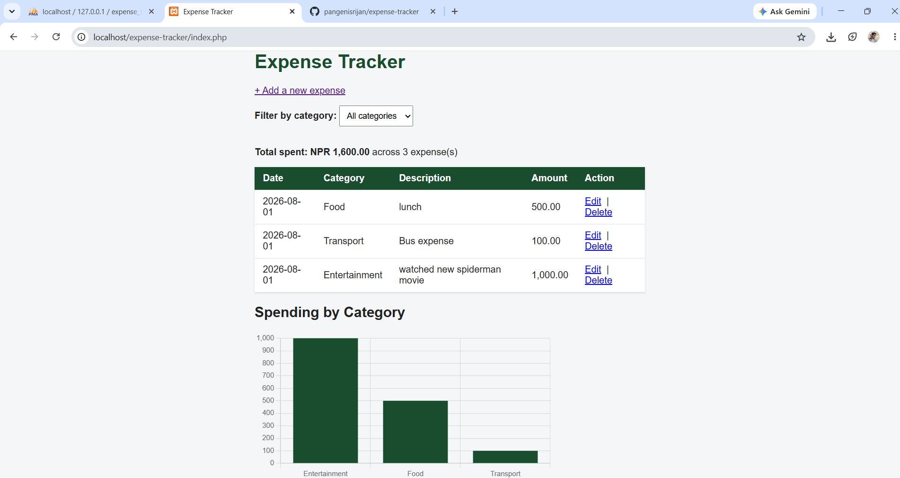
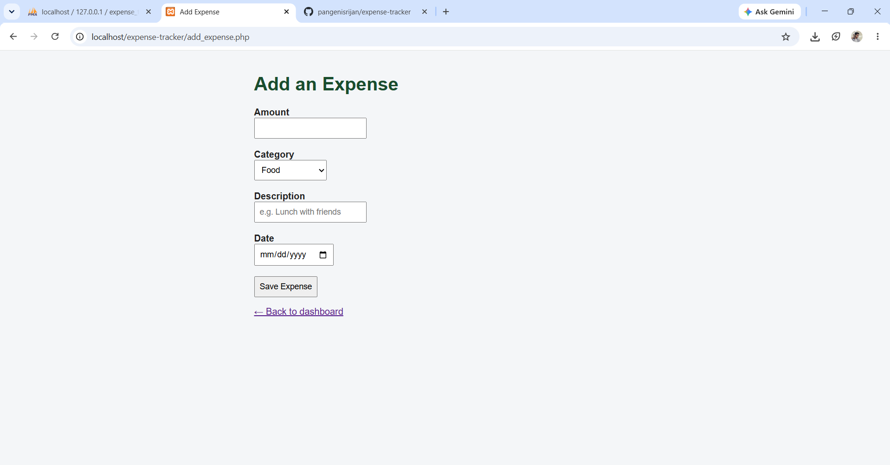

# Expense Tracker

A web-based expense tracker built with PHP, MySQL, HTML, CSS, and JavaScript.
Built as a mini-project to practice full-stack fundamentals: connecting a
frontend to a backend, and a backend to a relational database.

## CRUD Operations
| Operation | File | SQL Used |
|---|---|---|
| **C**reate | `add_expense.php` | `INSERT` |
| **R**ead | `index.php` | `SELECT` with `JOIN`, plus `GROUP BY` / `SUM()` for the chart |
| **U**pdate | `edit_expense.php` | `UPDATE ... WHERE` |
| **D**elete | `delete_expense.php` | `DELETE ... WHERE` |

All database writes use **prepared statements** (parameterized queries) rather
than raw string concatenation, to prevent SQL injection.

## Database Design
Relational schema with 3 tables and foreign key relationships:
- `users` (id, name, email, password)
- `categories` (id, name)
- `expenses` (id, user_id, category_id, amount, description, expense_date)
  — `user_id` and `category_id` are foreign keys referencing `users` and
  `categories`, so each expense is linked to exactly one user and one category.

See [`database/schema.sql`](database/schema.sql) for the full schema.

## Features
- [x] Database schema (users, categories, expenses)
- [x] PHP ↔ MySQL connection
- [x] Add expense (form + save to database)
- [x] View expenses in a table with running total
- [x] Edit / delete an expense
- [x] Filter by category
- [x] Spending-by-category chart (Chart.js)
- [ ] Filter by date range
- [ ] Login (currently single-user)

## Screenshots

**Dashboard with expenses and chart:**

**Expenses added, showing running total:**

**Add Expense form:**

## Tech stack
- **Frontend:** HTML, CSS, JavaScript
- **Backend:** PHP
- **Database:** MySQL
- **Local environment:** XAMPP (Apache + MySQL + PHP)

## How to run locally
1. Install [XAMPP](https://www.apachefriends.org/).
2. Copy this project folder into `htdocs` inside your XAMPP installation.
3. Start **Apache** and **MySQL** from the XAMPP control panel.
4. Open **phpMyAdmin** (`localhost/phpmyadmin`), create a database, and
   import `database/schema.sql`.
5. Visit `localhost/expense-tracker/` in your browser.

## What I learned
- How a full-stack web app actually works end to end: browser → PHP (server) → MySQL (database) → back to the browser as HTML.
- How to connect PHP to MySQL and run queries safely using prepared statements, to protect against SQL injection.
- How to use JOIN to combine data from two related tables (expenses and categories), and GROUP BY / SUM() to aggregate data for the chart.
- The difference between $_GET and $_POST, and when to use each (viewing/filtering vs. submitting/changing data).
- Basic JavaScript for interactivity: confirmation dialogs before deleting, auto-submitting a filter form, and rendering a chart with Chart.js.
- Git and GitHub as a real workflow: committing after each feature instead of all at once, and pushing to a public repo.
